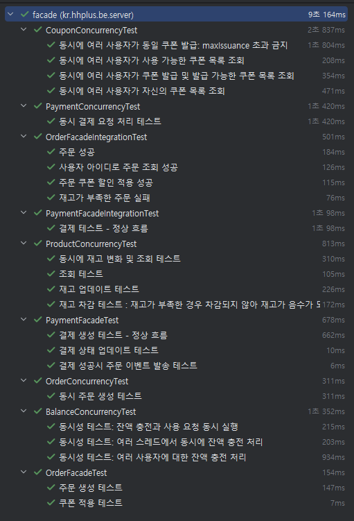
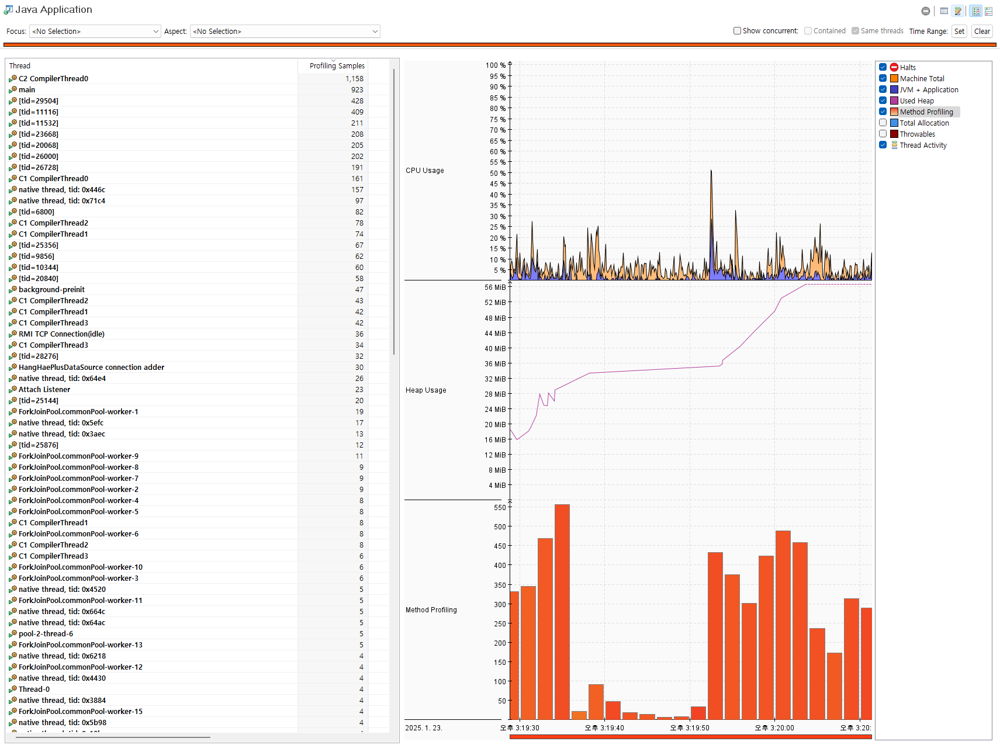
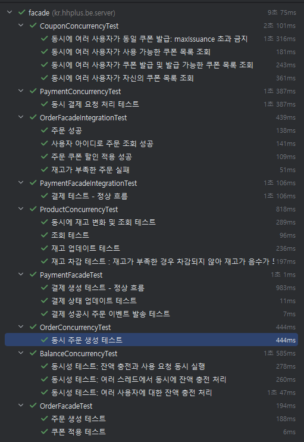
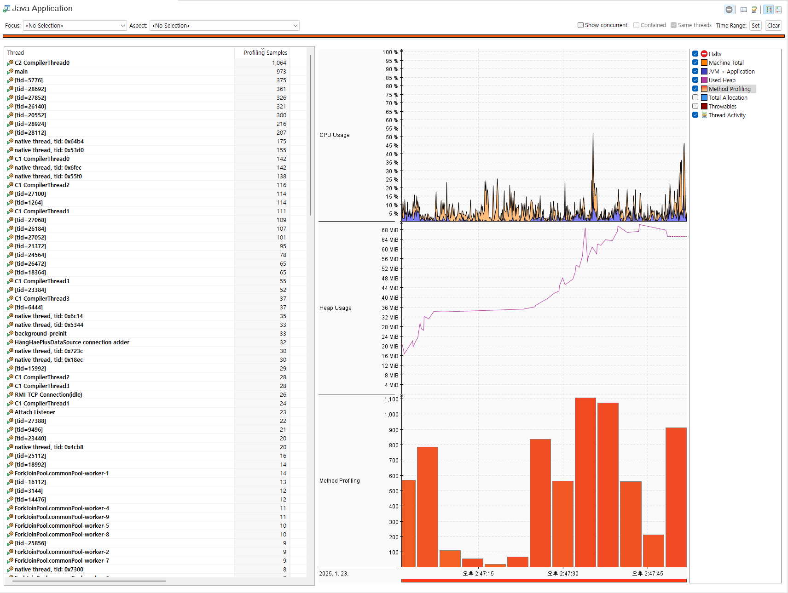

### 동시성 제어 방식 및 적용 사례 보고서

---

### 1. 서론

이커머스 시스템은 다중 사용자 환경에서 동일 데이터에 대한 동시 접근이 빈번히 발생하며, 이는 데이터 불일치, 경쟁 조건(Race Condition), 데드락(Deadlock)과 같은 동시성 문제를 초래할 가능성이 존재합니다.

특히 **결제, 주문, 재고 관리**와 같이 데이터 무결성과 신뢰도가 중요한 도메인에서는 동시성 제어가 필요합니다.

하여 시스템에서 발생할 수 있는 주요 동시성 시나리오를 식별하고, 이를 해결하기 위해 **비관적 잠금(Pessimistic Lock)** 과 **Redis 기반 분산 잠금**을 결합하여 적용한 사례를 설명하고 데이터 충돌 가능성과 중요도를 고려해 **낙관적 잠금(Optimistic Lock)** 은 배제한 이유를 기술합니다.

---

### 2. 시스템 시나리오 및 동시성 이슈

### 2.1 주요 동시성 시나리오

1. **PaymentFacade.createPayment (결제 생성)**
   - **문제**: 동일 사용자에 의한 중복 결제 요청 발생 가능성.
   - **원인**: 여러 요청이 동시에 잔액 차감 및 결제 데이터 생성 로직에 접근.
   - **결과**: 잔액 부족 상태에서도 결제가 처리될 위험.
2. **OrderFacade.createOrder (주문 생성)**
   - **문제**: 초과 판매 발생 가능성.
   - **원인**: 다중 사용자가 동일한 상품 재고를 동시에 확인 및 감소 처리.
   - **결과**: 재고 데이터 불일치.
3. **CouponFacade.assignCoupon (쿠폰 발급)**
   - **문제**: 쿠폰 발급 한도를 초과하거나, 동일 쿠폰이 중복 발급될 가능성.
   - **원인**: 동시 요청 간 쿠폰 발급 상태의 불일치.
   - **결과**: 최대 발급 한도를 초과.
4. **BalanceFacade.chargeBalance 및 useBalance (잔액 충전/사용)**
   - **문제**: 잘못된 잔액 업데이트.
   - **원인**: 여러 충전/사용 요청이 동시에 수행되면서 경합 발생.
   - **결과**: 최종 잔액이 올바르지 않음.

---

### 3. 동시성 제어 방식 및 적용

### 3.1 비관적 잠금 (Pessimistic Locking)

**설명**:

비관적 잠금은 데이터에 접근하기 전에 명시적으로 잠금을 설정하여 다른 트랜잭션의 접근을 차단합니다. 이를 통해 데이터 일관성을 보장하며, 충돌 가능성이 높은 환경에서 적합합니다.

**적용 사례**:

- **결제(Payment)**: 충돌 가능성이 높고, 데이터의 신뢰도가 중요한 도메인으로, `LockModeType.PESSIMISTIC_WRITE`를 사용하여 비관적 잠금을 적용했습니다.
- **재고 감소(Order)**: 다중 사용자가 동시에 상품 재고를 감소시킬 가능성이 높아 비관적 잠금을 활용했습니다.

**주문과 재고 감소의 상호작용**:

주문 생성(createOrder)과 재고 감소 과정은 동일 트랜잭션 내에서 수행되며, 아래의 흐름으로 동작합니다.

1. 상품 재고를 `LockModeType.PESSIMISTIC_WRITE`로 조회하여 잠금을 설정.
2. 재고가 충분하지 않을 경우 예외 발생.
3. 재고를 차감한 후 주문 데이터 생성.
4. 트랜잭션 커밋 시점에 재고와 주문 데이터를 동기화.

**예제 코드**:

```java
@Transactional
public Order createOrder(Long productId, Long userId, int quantity) {
    Stock stock = stockRepository.findByProductIdWithLock(productId)
            .orElseThrow(() -> new NotFoundException("재고를 찾을 수 없습니다"));

    if (stock.getQuantity() < quantity) {
        throw new InsufficientStockException("재고가 부족합니다");
    }

    stock.decreaseQuantity(quantity);
    stockRepository.save(stock);

    Order order = new Order(userId, productId, quantity);
    return orderRepository.save(order);
}

```

**장점**:

- 데이터 일관성 및 무결성 보장.
- 충돌 발생 가능성을 사전에 차단.

**단점**:

- 높은 경합 환경에서 성능 저하.
- 데드락 위험.

데드락 방지를 위해 **잠금 순서**를 일관되게 유지해야 하며, 필요 이상의 트랜잭션 범위를 줄여 성능 저하를 최소화해야 합니다.

**테스트 소요 시간**





---

### 3.2 Redis 기반 분산 잠금

**설명**:

Redis의 `SETNX` 명령어를 활용해 분산 환경에서 글로벌 잠금을 관리합니다. 이를 통해 다중 서버 간 데이터 충돌 문제를 방지합니다.

**적용 사례**:

- **쿠폰 발급(Coupon)**: 쿠폰 발급 한도를 초과하지 않도록 Redis 분산 잠금을 적용했습니다.
- **재고 감소(Order)**: 재고 관리에서도 글로벌 잠금을 통해 초과 판매를 방지했습니다.

**Redis 잠금 구현**:

- **키 생성 방식**: 키는 `keyPrefix`와 파라미터를 조합해 유니크한 형태로 생성합니다.

    ```java
       public class RedisLockAspect {
    
        private final RedissonClient redissonClient;
    
        @Around("@annotation(redisLock)")
        public Object around(ProceedingJoinPoint joinPoint, RedisLock redisLock) throws Throwable {
            String keyPrefix = redisLock.keyPrefix();
            String dynamicKey = generateDynamicKey(redisLock.key());
            String key = keyPrefix + ":" + dynamicKey; // 락 키에 유니크 컨텍스트 추가
            int expiration = redisLock.expiration();
    
            RLock lock = redissonClient.getLock(key);
    
            log.info("Attempting to acquire lock: {}", key);
    
            // 대기 시간을 늘리고 만료 시간을 조정
            boolean isLocked = lock.tryLock(30, expiration, TimeUnit.SECONDS);
            if (!isLocked) {
                log.error("Lock acquisition failed: {}", key);
                throw new CommonException(RedisErrorCode.REDIS_LOCK_FAILED);
            }
            try {
                return joinPoint.proceed();
            } finally {
                if (lock.isHeldByCurrentThread()) { // 안전한 unlock 처리
                    lock.unlock();
                    log.info("Lock released successfully: {}", key);
                }
            }
    
        }
    
        private String generateDynamicKey(String baseKey) {
            // Unique Key 생성 (예: 스레드 ID, 타임스탬프 포함)
            return baseKey + ":" + Thread.currentThread().getId() + ":" + System.currentTimeMillis();
        }
    }
    
    ```

- **만료 시간 관리**: 작업 시간이 만료 시간보다 길어지지 않도록 조정하며, 만료 시간이 지나도 작업이 중단되지 않도록 안전한 로직을 설계합니다.
- **락 해제**: 락 해제 로직은 작업 완료 후 반드시 실행되도록 보장해야 합니다.

**장점**:

- 다중 서버 환경에서 데이터 충돌 방지.
- 글로벌 락 제공으로 데이터 무결성 보장.

**단점**:

- 외부 시스템(Redis)에 의존.
- 네트워크 지연으로 성능 저하 가능.

**테스트 소요 시간**





---

### 3.3 낙관적 잠금 (Optimistic Locking)

**설명**:

낙관적 잠금은 데이터 갱신 시 버전 필드를 비교하여 충돌 여부를 감지합니다. 충돌 발생 시 예외를 던지고 재시도를 유도합니다.

**적용 배제 이유**:

- 충돌 가능성이 높은 도메인(결제, 재고 관리)에서는 재시도 로직의 복잡성 증가.
- 상태 전환이 많은 환경에서 적용 비효율적.

---

### **4. 결론**

**결제 및 재고 시스템에서 데이터 무결성을 보장하기 위해 동시성 제어는 반드시 시스템 요구사항에 맞춘 전략적 선택이 필요합니다.**

1. **비관적 잠금**은 충돌 가능성이 높고 데이터 신뢰도가 중요한 **결제**와 **재고 감소**에 적합하며, 트랜잭션 범위를 최소화하고 잠금 순서를 일관되게 설계함으로써 데드락 위험을 줄일 수 있습니다.
2. **Redis 기반 분산 잠금**은 다중 서버 환경에서 **글로벌 데이터 무결성**을 보장하며, 특히 **쿠폰 발급**과 **재고 관리**에서 TTL 설정 및 키 관리로 안전성을 확보할 수 있습니다.
3. **낙관적 잠금의 배제**는 충돌 가능성이 높은 도메인에서는 과도한 재시도로 인한 성능 저하를 방지하기 위함이며, 충돌 가능성이 낮은 도메인에서만 제한적으로 적용하는 것이 적절합니다.
4. **테스트 소요 시간**은 비관적 잠금이 높은 경합 환경에서 발생하는 성능 저하로 인해 더 많은 시간이 소요되는 반면, Redis 기반 분산 잠금은 네트워크 지연으로 인한 성능 저하 가능성이 있습니다.
   - Redis 기반 분산 잠금을 적용한 후 성능 테스트 결과, 주요 동시성 시나리오에서 평균 응답 시간이 **100ms에서 500ms 정도 감소**하는 효과를 확인했습니다.
   - **쿠폰 발급 처리 시간 감소**: Redis 잠금 적용 전에는 동시 요청 증가 시 경쟁으로 인해 쿠폰 발급 성공률이 낮아지고 처리 시간이 길어졌지만, Redis 분산 잠금 적용 후 처리 속도와 성공률이 모두 향상되었습니다.
   - **재고 감소 처리 효율성 증가**: 초과 판매 방지를 위한 재고 관리 로직의 잠금 처리 시간이 대폭 감소하여 다중 사용자 환경에서도 안정적으로 작동했습니다.
5. **동시성 제어 전략의 유연성**을 고려하여, 비관적 잠금과 Redis 기반 분산 잠금을 **조합**하여 적용하는 방법으로 진행하였습니다.